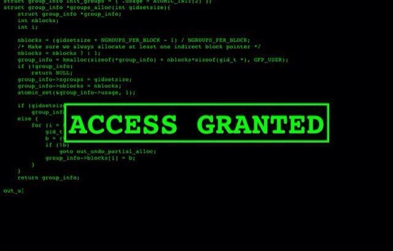

## 📊 Sistema de Gerenciamento de Banco de Dados em C 📊 


# Gerenciamento de Registros
Este projeto implementa um sistema simples de gerenciamento de banco de dados em C, permitindo criar, ler, atualizar e excluir registros de usuários. O sistema utiliza uma estrutura de dados para armazenar informações sobre usuários, incluindo ID, nome e email.

### Objetivo
O principal objetivo deste projeto é fornecer uma interface básica para gerenciar registros de usuários em um banco de dados em memória, facilitando operações CRUD (Criar, Ler, Atualizar, Excluir).

## Funcionalidades
- **Criar Registro:** Permite adicionar novos registros ao banco de dados.
- **Ler Registros:** Exibe todos os registros armazenados.
- **Atualizar Registro:** Modifica as informações de um registro existente com base no ID fornecido.
- **Excluir Registro:** Remove um registro do banco de dados usando seu ID.
- **Sair:** Finaliza a execução do programa.

## Principais Componentes
### Estrutura de Dados:
- O sistema utiliza uma estrutura `Record` para armazenar informações dos usuários, com os seguintes campos:
    - `id`: ID único do registro.
    - `name`: Nome do usuário.
    - `email`: Email do usuário.

### Banco de Dados em Memória:
- Os registros são armazenados em um array chamado `database`, que pode conter até 100 registros.

## Estrutura do Código
### 1. Inclusão de Bibliotecas
O código inclui bibliotecas padrão como `stdio.h`, `stdlib.h` e `string.h` para manipulação de entrada/saída, alocação de memória e manipulação de strings.

### 2. Funções Principais
- **create_record:** Cria um novo registro e o adiciona ao banco de dados.
- **read_records:** Lê e exibe todos os registros armazenados.
- **update_record:** Atualiza as informações de um registro existente com base no ID fornecido.
- **delete_record:** Exclui um registro do banco de dados usando seu ID.

### 3. Loop Principal
O programa apresenta um menu interativo que permite ao usuário escolher a operação desejada e executá-la.

## Requisitos
### Compilador:
- GCC (GNU Compiler Collection) para compilar o código em C.

## Como Rodar o Projeto
### 1. Clone este repositório.

### 2. Salve o código em um arquivo chamado `gerenciamento_banco_dados.c`.

### 3. Compile o código usando o GCC:
```bash
gcc gerenciamento_banco_dados.c -o gerenciamento_banco_dados
```

### 4. Execute o programa:
```bash
./gerenciamento_banco_dados
```

### 5. Exemplo de Saída
```plaintext
    Sistema de Gerenciamento de Banco de Dados
    1. Criar Registro
    2. Ler Registros
    3. Atualizar Registro
    4. Excluir Registro
    5. Sair
    Escolha uma opção: 1
    Digite ID: 1
    Digite Nome: João
    Digite Email: joao@example.com
    Registro criado com sucesso!
```
## Licença
Este projeto está licenciado sob a [MIT License](LICENSE).